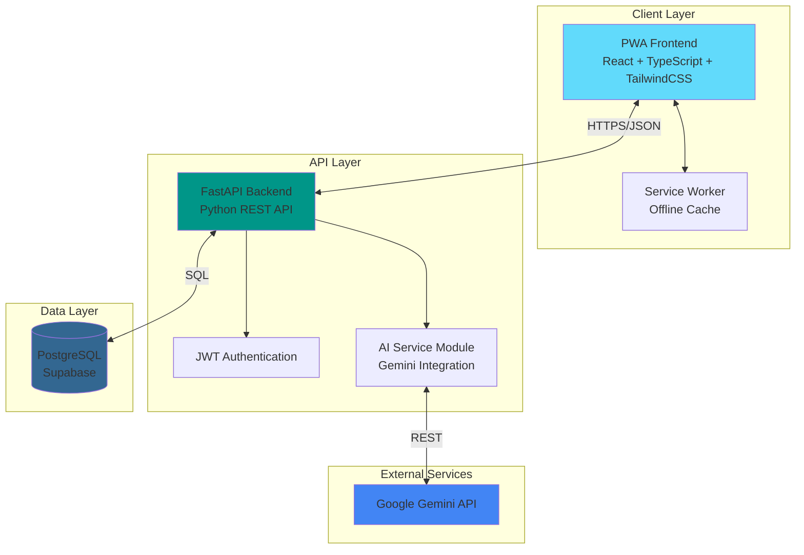
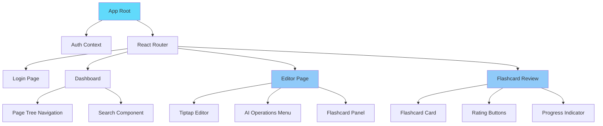
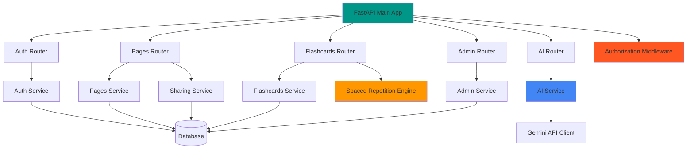
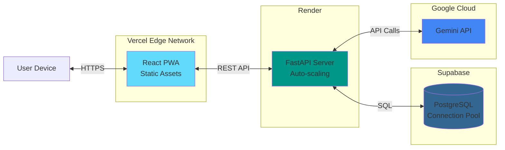
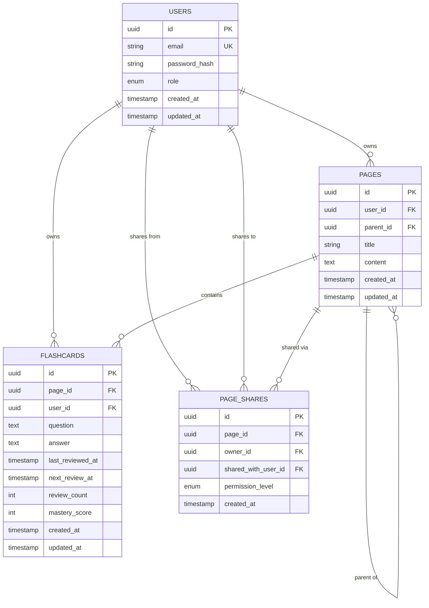

# Design Document: MemoryEngine

## Overview

MemoryEngine is an AI-powered knowledge management system built with a modern web stack. The system consists of three primary layers:

1. **Frontend**: React + TypeScript + TailwindCSS Progressive Web Application
2. **Backend**: FastAPI REST API server with Python
3. **Database**: PostgreSQL hosted on Supabase

The architecture follows a clean separation of concerns with RESTful communication between layers. The system integrates Google Gemini API for AI-powered content enhancement and implements a spaced repetition algorithm for optimized learning.

Key technical decisions:

- **Tiptap** for rich text editing with Markdown support
- **JWT** for stateless authentication
- **Service Worker** for PWA offline capabilities
- **Supabase** for managed PostgreSQL with connection pooling
- **Vercel** for frontend deployment with edge network
- **Render** for backend deployment with auto-scaling

## Architecture

### System Architecture Diagram



### Component Architecture

#### Frontend Components



#### Backend Modules



### Deployment Architecture



## Components and Interfaces

### Frontend Components

#### 1. Page Tree Navigation Component

**Purpose**: Display hierarchical page structure with expand/collapse functionality

**Props**:

```typescript
interface PageTreeProps {
  pages: Page[];
  selectedPageId: string | null;
  onPageSelect: (pageId: string) => void;
  onPageCreate: (parentId: string | null) => void;
  onPageDelete: (pageId: string) => void;
}
```

**State Management**: Uses React Context for page tree state

**Key Features**:

- Recursive rendering for nested pages
- Drag-and-drop for page reorganization
- Lazy loading for large trees
- Keyboard navigation support

#### 2. Tiptap Editor Component

**Purpose**: Dual-mode rich text and Markdown editor

**Props**:

```typescript
interface EditorProps {
  content: string;
  onChange: (content: string) => void;
  mode: "richtext" | "markdown";
  onModeToggle: () => void;
  onAIOperation: (operation: AIOperation, selectedText: string) => void;
}
```

**Extensions Used**:

- StarterKit (basic formatting)
- Markdown (syntax support)
- Placeholder
- CharacterCount
- CodeBlockLowlight (syntax highlighting)

**Key Features**:

- Real-time Markdown preview
- Text selection detection for AI operations
- Auto-save with debouncing
- Collaborative editing ready (future enhancement)

#### 3. Flashcard Review Component

**Purpose**: Mobile-optimized flashcard review interface

**Props**:

```typescript
interface FlashcardReviewProps {
  flashcards: Flashcard[];
  onRate: (flashcardId: string, rating: "easy" | "medium" | "hard") => void;
  onComplete: () => void;
}
```

**State**:

- Current flashcard index
- Show answer state
- Review session statistics

**Key Features**:

- Swipe gesture support (Hammer.js or React Swipeable)
- Flip animation for answer reveal
- Progress tracking
- Session summary

#### 4. AI Operations Menu Component

**Purpose**: Context menu for AI-powered text operations

**Props**:

```typescript
interface AIMenuProps {
  selectedText: string;
  position: { x: number; y: number };
  onOperation: (operation: AIOperation) => void;
  onClose: () => void;
}

type AIOperation =
  | "rephrase"
  | "enhance"
  | "simplify"
  | "generate_questions"
  | "generate_flashcards";
```

**Key Features**:

- Positioned near text selection
- Loading states during API calls
- Error handling with retry
- Keyboard shortcuts

### Backend API Endpoints

#### Authentication Endpoints

```
POST   /api/auth/register
POST   /api/auth/login
POST   /api/auth/refresh
POST   /api/auth/logout
GET    /api/auth/me
```

#### Pages Endpoints

```
GET    /api/pages                    # List all user's pages (owned + shared)
GET    /api/pages/:id                # Get specific page
POST   /api/pages                    # Create new page
PUT    /api/pages/:id                # Update page
DELETE /api/pages/:id                # Delete page
GET    /api/pages/:id/children       # Get child pages
GET    /api/pages/search?q=query     # Search pages by title and content
POST   /api/pages/:id/share          # Share page with user
DELETE /api/pages/:id/share/:userId  # Revoke page share
GET    /api/pages/:id/shares         # List all shares for a page
```

#### Flashcards Endpoints

```
GET    /api/flashcards               # List all user's flashcards
GET    /api/flashcards/:id           # Get specific flashcard
POST   /api/flashcards               # Create flashcard
PUT    /api/flashcards/:id           # Update flashcard
DELETE /api/flashcards/:id           # Delete flashcard
GET    /api/flashcards/due           # Get flashcards due for review
POST   /api/flashcards/:id/review    # Submit flashcard review
GET    /api/pages/:id/flashcards     # Get flashcards for page
```

#### AI Operations Endpoints

```
POST   /api/ai/rephrase              # Rephrase selected text
POST   /api/ai/enhance               # Enhance with details
POST   /api/ai/simplify              # Simplify explanation
POST   /api/ai/generate-questions    # Generate interview questions
POST   /api/ai/generate-flashcards   # Generate flashcards
POST   /api/ai/image-to-markdown     # Convert handwritten image
```

#### Health and Monitoring

```
GET    /api/health                   # Health check endpoint
GET    /api/metrics                  # System metrics (admin only)
```

#### Admin Endpoints

```
GET    /api/admin/users              # List all users (admin only)
PUT    /api/admin/users/:id/role     # Update user role (admin only)
DELETE /api/admin/users/:id          # Delete user (admin only)
```

### Request/Response Schemas

#### Page Schema

```typescript
interface Page {
  id: string;
  user_id: string;
  parent_id: string | null;
  title: string;
  content: string; // Markdown format
  created_at: string;
  updated_at: string;
  children?: Page[]; // Populated in tree queries
  is_shared?: boolean; // True if page is shared with current user
  permission?: "view_only" | "edit"; // Permission level if shared
  owner_email?: string; // Email of owner if shared
}

interface CreatePageRequest {
  parent_id?: string | null;
  title: string;
  content?: string;
}

interface UpdatePageRequest {
  title?: string;
  content?: string;
  parent_id?: string | null;
}

interface SharePageRequest {
  shared_with_user_id: string;
  permission_level: "view_only" | "edit";
}

interface PageShare {
  id: string;
  page_id: string;
  owner_id: string;
  shared_with_user_id: string;
  shared_with_email: string;
  permission_level: "view_only" | "edit";
  created_at: string;
}
```

#### Flashcard Schema

```typescript
interface Flashcard {
  id: string;
  page_id: string;
  user_id: string;
  question: string;
  answer: string;
  last_reviewed_at: string | null;
  next_review_at: string;
  review_count: number;
  mastery_score: number; // 0-100
  created_at: string;
  updated_at: string;
}

interface CreateFlashcardRequest {
  page_id: string;
  question: string;
  answer: string;
}

interface ReviewFlashcardRequest {
  rating: "easy" | "medium" | "hard";
}

interface ReviewFlashcardResponse {
  flashcard: Flashcard;
  next_review_at: string;
  mastery_score: number;
}
```

#### AI Operation Schemas

```typescript
interface AIRephraseRequest {
  text: string;
}

interface AIRephraseResponse {
  original: string;
  rephrased: string;
}

interface AIEnhanceRequest {
  text: string;
}

interface AIEnhanceResponse {
  original: string;
  enhanced: string;
}

interface AISimplifyRequest {
  text: string;
}

interface AISimplifyResponse {
  original: string;
  simplified: string;
}

interface AIGenerateQuestionsRequest {
  text: string;
  count?: number; // Default: 5
}

interface AIGenerateQuestionsResponse {
  questions: string[];
}

interface AIGenerateFlashcardsRequest {
  text: string;
  count?: number; // Default: 5
}

interface AIGenerateFlashcardsResponse {
  flashcards: Array<{
    question: string;
    answer: string;
  }>;
}

interface AIImageToMarkdownRequest {
  image: File; // multipart/form-data
}

interface AIImageToMarkdownResponse {
  markdown: string;
  confidence: number; // 0-1
}
```

#### Authentication Schemas

```typescript
interface RegisterRequest {
  email: string;
  password: string;
}

interface LoginRequest {
  email: string;
  password: string;
}

interface AuthResponse {
  access_token: string;
  refresh_token: string;
  token_type: "bearer";
  expires_in: number;
  user: {
    id: string;
    email: string;
    role: "admin" | "user";
  };
}

interface UpdateUserRoleRequest {
  role: "admin" | "user";
}
```

## Data Models

### Database Schema

#### Users Table

```sql
CREATE TYPE user_role AS ENUM ('admin', 'user');

CREATE TABLE users (
    id UUID PRIMARY KEY DEFAULT gen_random_uuid(),
    email VARCHAR(255) UNIQUE NOT NULL,
    password_hash VARCHAR(255) NOT NULL,
    role user_role NOT NULL DEFAULT 'user',
    created_at TIMESTAMP WITH TIME ZONE DEFAULT CURRENT_TIMESTAMP,
    updated_at TIMESTAMP WITH TIME ZONE DEFAULT CURRENT_TIMESTAMP
);

CREATE INDEX idx_users_email ON users(email);
CREATE INDEX idx_users_role ON users(role);
```

#### Pages Table

```sql
CREATE TABLE pages (
    id UUID PRIMARY KEY DEFAULT gen_random_uuid(),
    user_id UUID NOT NULL REFERENCES users(id) ON DELETE CASCADE,
    parent_id UUID REFERENCES pages(id) ON DELETE CASCADE,
    title VARCHAR(500) NOT NULL,
    content TEXT,
    created_at TIMESTAMP WITH TIME ZONE DEFAULT CURRENT_TIMESTAMP,
    updated_at TIMESTAMP WITH TIME ZONE DEFAULT CURRENT_TIMESTAMP,

    CONSTRAINT no_self_reference CHECK (id != parent_id)
);

CREATE INDEX idx_pages_user_id ON pages(user_id);
CREATE INDEX idx_pages_parent_id ON pages(parent_id);
CREATE INDEX idx_pages_title ON pages(title);
CREATE INDEX idx_pages_content_fts ON pages USING GIN(to_tsvector('english', content));
```

#### Flashcards Table

```sql
CREATE TABLE flashcards (
    id UUID PRIMARY KEY DEFAULT gen_random_uuid(),
    page_id UUID NOT NULL REFERENCES pages(id) ON DELETE CASCADE,
    user_id UUID NOT NULL REFERENCES users(id) ON DELETE CASCADE,
    question TEXT NOT NULL,
    answer TEXT NOT NULL,
    last_reviewed_at TIMESTAMP WITH TIME ZONE,
    next_review_at TIMESTAMP WITH TIME ZONE DEFAULT CURRENT_TIMESTAMP,
    review_count INTEGER DEFAULT 0 CHECK (review_count >= 0),
    mastery_score INTEGER DEFAULT 0 CHECK (mastery_score >= 0 AND mastery_score <= 100),
    created_at TIMESTAMP WITH TIME ZONE DEFAULT CURRENT_TIMESTAMP,
    updated_at TIMESTAMP WITH TIME ZONE DEFAULT CURRENT_TIMESTAMP
);

CREATE INDEX idx_flashcards_user_id ON flashcards(user_id);
CREATE INDEX idx_flashcards_page_id ON flashcards(page_id);
CREATE INDEX idx_flashcards_next_review ON flashcards(user_id, next_review_at);
CREATE INDEX idx_flashcards_mastery ON flashcards(user_id, mastery_score);
```

#### Page Shares Table

```sql
CREATE TYPE permission_level AS ENUM ('view_only', 'edit');

CREATE TABLE page_shares (
    id UUID PRIMARY KEY DEFAULT gen_random_uuid(),
    page_id UUID NOT NULL REFERENCES pages(id) ON DELETE CASCADE,
    owner_id UUID NOT NULL REFERENCES users(id) ON DELETE CASCADE,
    shared_with_user_id UUID NOT NULL REFERENCES users(id) ON DELETE CASCADE,
    permission_level permission_level NOT NULL DEFAULT 'view_only',
    created_at TIMESTAMP WITH TIME ZONE DEFAULT CURRENT_TIMESTAMP,

    CONSTRAINT unique_page_share UNIQUE (page_id, shared_with_user_id),
    CONSTRAINT no_self_share CHECK (owner_id != shared_with_user_id)
);

CREATE INDEX idx_page_shares_page_id ON page_shares(page_id);
CREATE INDEX idx_page_shares_shared_with ON page_shares(shared_with_user_id);
CREATE INDEX idx_page_shares_owner ON page_shares(owner_id);
```

#### Database Triggers

```sql
-- Auto-update updated_at timestamp
CREATE OR REPLACE FUNCTION update_updated_at_column()
RETURNS TRIGGER AS $$
BEGIN
    NEW.updated_at = CURRENT_TIMESTAMP;
    RETURN NEW;
END;
$$ language 'plpgsql';

CREATE TRIGGER update_users_updated_at BEFORE UPDATE ON users
    FOR EACH ROW EXECUTE FUNCTION update_updated_at_column();

CREATE TRIGGER update_pages_updated_at BEFORE UPDATE ON pages
    FOR EACH ROW EXECUTE FUNCTION update_updated_at_column();

CREATE TRIGGER update_flashcards_updated_at BEFORE UPDATE ON flashcards
    FOR EACH ROW EXECUTE FUNCTION update_updated_at_column();
```

#### Preventing Circular References

To prevent circular parent-child relationships in pages, we implement a database function:

```sql
CREATE OR REPLACE FUNCTION check_page_hierarchy_cycle()
RETURNS TRIGGER AS $$
DECLARE
    current_parent_id UUID;
    depth INTEGER := 0;
    max_depth INTEGER := 100;
BEGIN
    -- If no parent, no cycle possible
    IF NEW.parent_id IS NULL THEN
        RETURN NEW;
    END IF;

    -- Cannot be own parent (also checked by constraint)
    IF NEW.id = NEW.parent_id THEN
        RAISE EXCEPTION 'Page cannot be its own parent';
    END IF;

    -- Traverse up the tree to check for cycles
    current_parent_id := NEW.parent_id;

    WHILE current_parent_id IS NOT NULL AND depth < max_depth LOOP
        -- If we encounter the current page ID, we have a cycle
        IF current_parent_id = NEW.id THEN
            RAISE EXCEPTION 'Circular reference detected in page hierarchy';
        END IF;

        -- Move up to next parent
        SELECT parent_id INTO current_parent_id
        FROM pages
        WHERE id = current_parent_id;

        depth := depth + 1;
    END LOOP;

    -- If we hit max depth, something is wrong
    IF depth >= max_depth THEN
        RAISE EXCEPTION 'Page hierarchy exceeds maximum depth';
    END IF;

    RETURN NEW;
END;
$$ LANGUAGE plpgsql;

CREATE TRIGGER check_page_cycle BEFORE INSERT OR UPDATE ON pages
    FOR EACH ROW EXECUTE FUNCTION check_page_hierarchy_cycle();
```

#### First User Admin Assignment

To automatically assign admin role to the first user:

```sql
CREATE OR REPLACE FUNCTION assign_first_user_admin()
RETURNS TRIGGER AS $$
DECLARE
    user_count INTEGER;
BEGIN
    -- Count existing users
    SELECT COUNT(*) INTO user_count FROM users;

    -- If this is the first user, make them admin
    IF user_count = 0 THEN
        NEW.role := 'admin';
    END IF;

    RETURN NEW;
END;
$$ LANGUAGE plpgsql;

CREATE TRIGGER set_first_user_admin BEFORE INSERT ON users
    FOR EACH ROW EXECUTE FUNCTION assign_first_user_admin();
```

### Authorization and Sharing Implementation

#### Authorization Middleware

```python
from functools import wraps
from fastapi import HTTPException, Depends
from typing import Callable

def require_role(required_role: str):
    """
    Decorator to require specific user role for endpoint access.

    Args:
        required_role: 'admin' or 'user'
    """
    def decorator(func: Callable):
        @wraps(func)
        async def wrapper(*args, current_user: User = Depends(get_current_user), **kwargs):
            if current_user.role != required_role and required_role == 'admin':
                raise HTTPException(
                    status_code=403,
                    detail="Insufficient permissions. Admin role required."
                )
            return await func(*args, current_user=current_user, **kwargs)
        return wrapper
    return decorator

# Usage example
@router.put("/users/{user_id}/role")
@require_role("admin")
async def update_user_role(
    user_id: str,
    role_update: UpdateUserRoleRequest,
    current_user: User = Depends(get_current_user)
):
    # Only admins can reach this code
    pass
```

#### Page Access Control

```python
class PageAccessLevel(Enum):
    NONE = "none"
    VIEW = "view_only"
    EDIT = "edit"
    OWNER = "owner"

async def check_page_access(
    page_id: str,
    user_id: str,
    db: AsyncSession
) -> PageAccessLevel:
    """
    Check user's access level for a specific page.

    Returns:
        PageAccessLevel indicating user's permission level
    """
    # Check if user owns the page
    page = await db.execute(
        select(Page).where(Page.id == page_id, Page.user_id == user_id)
    )
    if page.scalar_one_or_none():
        return PageAccessLevel.OWNER

    # Check if page is shared with user
    share = await db.execute(
        select(PageShare).where(
            PageShare.page_id == page_id,
            PageShare.shared_with_user_id == user_id
        )
    )
    share_record = share.scalar_one_or_none()

    if share_record:
        if share_record.permission_level == "edit":
            return PageAccessLevel.EDIT
        else:
            return PageAccessLevel.VIEW

    return PageAccessLevel.NONE

async def require_page_access(
    page_id: str,
    user_id: str,
    required_level: PageAccessLevel,
    db: AsyncSession
):
    """
    Verify user has required access level for page.

    Raises:
        HTTPException: If access is insufficient
    """
    access_level = await check_page_access(page_id, user_id, db)

    # Define access hierarchy
    hierarchy = {
        PageAccessLevel.NONE: 0,
        PageAccessLevel.VIEW: 1,
        PageAccessLevel.EDIT: 2,
        PageAccessLevel.OWNER: 3
    }

    if hierarchy[access_level] < hierarchy[required_level]:
        if access_level == PageAccessLevel.NONE:
            raise HTTPException(status_code=404, detail="Page not found")
        else:
            raise HTTPException(
                status_code=403,
                detail=f"Insufficient permissions. {required_level.value} access required."
            )
```

#### Sharing Service

```python
class SharingService:
    def __init__(self, db: AsyncSession):
        self.db = db

    async def share_page(
        self,
        page_id: str,
        owner_id: str,
        shared_with_user_id: str,
        permission_level: str
    ) -> PageShare:
        """
        Share a page with another user.

        Args:
            page_id: ID of page to share
            owner_id: ID of page owner
            shared_with_user_id: ID of user to share with
            permission_level: 'view_only' or 'edit'

        Returns:
            Created PageShare record

        Raises:
            HTTPException: If validation fails
        """
        # Verify page ownership
        page = await self.db.execute(
            select(Page).where(Page.id == page_id, Page.user_id == owner_id)
        )
        if not page.scalar_one_or_none():
            raise HTTPException(status_code=404, detail="Page not found or not owned by user")

        # Verify target user exists
        user = await self.db.execute(
            select(User).where(User.id == shared_with_user_id)
        )
        if not user.scalar_one_or_none():
            raise HTTPException(status_code=404, detail="Target user not found")

        # Check for self-sharing (also prevented by DB constraint)
        if owner_id == shared_with_user_id:
            raise HTTPException(status_code=400, detail="Cannot share page with yourself")

        # Create or update share
        existing_share = await self.db.execute(
            select(PageShare).where(
                PageShare.page_id == page_id,
                PageShare.shared_with_user_id == shared_with_user_id
            )
        )
        share = existing_share.scalar_one_or_none()

        if share:
            # Update existing share
            share.permission_level = permission_level
        else:
            # Create new share
            share = PageShare(
                page_id=page_id,
                owner_id=owner_id,
                shared_with_user_id=shared_with_user_id,
                permission_level=permission_level
            )
            self.db.add(share)

        await self.db.commit()
        await self.db.refresh(share)
        return share

    async def revoke_share(
        self,
        page_id: str,
        owner_id: str,
        shared_with_user_id: str
    ):
        """
        Revoke page share from a user.

        Args:
            page_id: ID of shared page
            owner_id: ID of page owner
            shared_with_user_id: ID of user to revoke access from

        Raises:
            HTTPException: If share not found or not authorized
        """
        # Verify ownership
        page = await self.db.execute(
            select(Page).where(Page.id == page_id, Page.user_id == owner_id)
        )
        if not page.scalar_one_or_none():
            raise HTTPException(status_code=404, detail="Page not found or not owned by user")

        # Delete share
        result = await self.db.execute(
            delete(PageShare).where(
                PageShare.page_id == page_id,
                PageShare.shared_with_user_id == shared_with_user_id
            )
        )

        if result.rowcount == 0:
            raise HTTPException(status_code=404, detail="Share not found")

        await self.db.commit()

    async def get_page_shares(
        self,
        page_id: str,
        owner_id: str
    ) -> list[PageShare]:
        """
        Get all shares for a page.

        Args:
            page_id: ID of page
            owner_id: ID of page owner

        Returns:
            List of PageShare records with user details
        """
        # Verify ownership
        page = await self.db.execute(
            select(Page).where(Page.id == page_id, Page.user_id == owner_id)
        )
        if not page.scalar_one_or_none():
            raise HTTPException(status_code=404, detail="Page not found or not owned by user")

        # Get shares with user email
        result = await self.db.execute(
            select(PageShare, User.email)
            .join(User, PageShare.shared_with_user_id == User.id)
            .where(PageShare.page_id == page_id)
        )

        shares = []
        for share, email in result.all():
            share_dict = {
                "id": share.id,
                "page_id": share.page_id,
                "owner_id": share.owner_id,
                "shared_with_user_id": share.shared_with_user_id,
                "shared_with_email": email,
                "permission_level": share.permission_level,
                "created_at": share.created_at
            }
            shares.append(share_dict)

        return shares
```

#### Enhanced Search with Sharing

```python
async def search_pages(
    query: str,
    user_id: str,
    db: AsyncSession,
    limit: int = 50,
    offset: int = 0
) -> list[Page]:
    """
    Search pages by title and content, including shared pages.

    Results are ordered by:
    1. Exact title match
    2. Title contains query
    3. Content contains query

    Args:
        query: Search query string
        user_id: Current user ID
        db: Database session
        limit: Maximum results to return
        offset: Pagination offset

    Returns:
        List of pages with access information
    """
    query_lower = query.lower()

    # Build query for owned pages
    owned_pages = (
        select(
            Page,
            literal("owner").label("access_type"),
            literal(None).label("permission_level")
        )
        .where(Page.user_id == user_id)
        .where(
            or_(
                func.lower(Page.title).contains(query_lower),
                func.lower(Page.content).contains(query_lower)
            )
        )
    )

    # Build query for shared pages
    shared_pages = (
        select(
            Page,
            literal("shared").label("access_type"),
            PageShare.permission_level
        )
        .join(PageShare, Page.id == PageShare.page_id)
        .where(PageShare.shared_with_user_id == user_id)
        .where(
            or_(
                func.lower(Page.title).contains(query_lower),
                func.lower(Page.content).contains(query_lower)
            )
        )
    )

    # Union queries
    combined = union_all(owned_pages, shared_pages).subquery()

    # Order by relevance
    result = await db.execute(
        select(combined)
        .order_by(
            # Exact title match first
            case(
                (func.lower(combined.c.title) == query_lower, 0),
                else_=1
            ),
            # Title contains query second
            case(
                (func.lower(combined.c.title).contains(query_lower), 0),
                else_=1
            ),
            # Then by title alphabetically
            combined.c.title
        )
        .limit(limit)
        .offset(offset)
    )

    return result.all()
```

### Entity Relationships



### Spaced Repetition Algorithm

The system implements a simplified spaced repetition algorithm based on SM-2 principles:

#### Algorithm Parameters

```python
# Review intervals (in days)
INTERVAL_HARD = 2
INTERVAL_MEDIUM = 4
INTERVAL_EASY = 7

# Mastery score adjustments
MASTERY_INCREASE_EASY = 10
MASTERY_INCREASE_MEDIUM = 5
MASTERY_DECREASE_HARD = 15

# Mastery score bounds
MASTERY_MIN = 0
MASTERY_MAX = 100
```

#### Review Scheduling Logic

```python
def calculate_next_review(
    flashcard: Flashcard,
    rating: str,
    current_time: datetime
) -> tuple[datetime, int]:
    """
    Calculate next review date and updated mastery score.

    Args:
        flashcard: Current flashcard state
        rating: User rating ('easy', 'medium', 'hard')
        current_time: Current timestamp

    Returns:
        Tuple of (next_review_at, new_mastery_score)
    """
    # Determine interval based on rating
    if rating == 'easy':
        interval_days = INTERVAL_EASY
        mastery_delta = MASTERY_INCREASE_EASY
    elif rating == 'medium':
        interval_days = INTERVAL_MEDIUM
        mastery_delta = MASTERY_INCREASE_MEDIUM
    else:  # hard
        interval_days = INTERVAL_HARD
        mastery_delta = -MASTERY_DECREASE_HARD

    # Apply mastery multiplier for high-mastery cards
    if flashcard.mastery_score >= 80 and rating == 'easy':
        interval_days *= 2  # Double interval for well-known cards

    # Calculate next review date
    next_review_at = current_time + timedelta(days=interval_days)

    # Update mastery score with bounds
    new_mastery = flashcard.mastery_score + mastery_delta
    new_mastery = max(MASTERY_MIN, min(MASTERY_MAX, new_mastery))

    return next_review_at, new_mastery
```

#### Flashcard Selection for Review

```python
def get_due_flashcards(
    user_id: str,
    current_time: datetime,
    limit: int = 20
) -> list[Flashcard]:
    """
    Get flashcards due for review, prioritized by urgency.

    Priority order:
    1. Overdue cards (next_review_at < current_time)
    2. Cards due today
    3. Low mastery cards (mastery_score < 50)

    Args:
        user_id: User identifier
        current_time: Current timestamp
        limit: Maximum number of cards to return

    Returns:
        List of flashcards ordered by priority
    """
    query = """
        SELECT * FROM flashcards
        WHERE user_id = $1 AND next_review_at <= $2
        ORDER BY
            CASE
                WHEN mastery_score < 50 THEN 0
                ELSE 1
            END,
            next_review_at ASC,
            mastery_score ASC
        LIMIT $3
    """
    return execute_query(query, user_id, current_time, limit)
```

### AI Service Integration

#### Google Gemini API Configuration

```python
# API Configuration
GEMINI_API_KEY = os.getenv('GEMINI_API_KEY')
GEMINI_MODEL = 'gemini-1.5-flash'  # Free tier model
GEMINI_MAX_TOKENS = 2048
GEMINI_TEMPERATURE = 0.7

# Rate limiting (free tier)
RATE_LIMIT_REQUESTS_PER_MINUTE = 15
RATE_LIMIT_REQUESTS_PER_DAY = 1500
```

#### Prompt Templates

```python
PROMPTS = {
    'rephrase': """
        Rephrase the following text while maintaining its original meaning.
        Provide only the rephrased version without explanations.

        Text: {text}
    """,

    'enhance': """
        Enhance the following text by adding relevant details, examples,
        and explanations. Make it more comprehensive while staying focused.

        Text: {text}
    """,

    'simplify': """
        Simplify the following text to make it easier to understand.
        Use simpler vocabulary and shorter sentences while preserving accuracy.

        Text: {text}
    """,

    'generate_questions': """
        Generate {count} technical interview questions based on the following content.
        Focus on practical application and problem-solving.
        Return as a JSON array of strings.

        Content: {text}
    """,

    'generate_flashcards': """
        Generate {count} flashcard question-answer pairs from the following content.
        Questions should test understanding and recall.
        Return as JSON array with format: [{{"question": "...", "answer": "..."}}]

        Content: {text}
    """,

    'image_to_markdown': """
        Convert the handwritten notes in this image to well-structured Markdown.
        Preserve mathematical notation, code snippets, and formatting.
        If text is unclear, indicate with [unclear].
    """
}
```

#### Error Handling and Retry Logic

```python
class AIService:
    def __init__(self):
        self.client = genai.Client(api_key=GEMINI_API_KEY)
        self.rate_limiter = RateLimiter(
            requests_per_minute=RATE_LIMIT_REQUESTS_PER_MINUTE
        )

    async def call_api(
        self,
        prompt: str,
        max_retries: int = 3
    ) -> str:
        """
        Call Gemini API with retry logic and rate limiting.
        """
        for attempt in range(max_retries):
            try:
                # Check rate limit
                await self.rate_limiter.acquire()

                # Make API call
                response = await self.client.generate_content(
                    model=GEMINI_MODEL,
                    prompt=prompt,
                    max_tokens=GEMINI_MAX_TOKENS,
                    temperature=GEMINI_TEMPERATURE
                )

                return response.text

            except RateLimitError:
                if attempt == max_retries - 1:
                    raise AIServiceError("Rate limit exceeded")
                await asyncio.sleep(2 ** attempt)  # Exponential backoff

            except APIError as e:
                if attempt == max_retries - 1:
                    raise AIServiceError(f"API error: {str(e)}")
                await asyncio.sleep(2 ** attempt)

        raise AIServiceError("Max retries exceeded")
```

### PWA Configuration

#### Manifest File

```json
{
  "name": "MemoryEngine",
  "short_name": "MemoryEngine",
  "description": "AI-powered knowledge management and spaced repetition learning",
  "start_url": "/",
  "display": "standalone",
  "background_color": "#ffffff",
  "theme_color": "#4285f4",
  "orientation": "portrait",
  "icons": [
    {
      "src": "/icons/icon-72x72.png",
      "sizes": "72x72",
      "type": "image/png"
    },
    {
      "src": "/icons/icon-96x96.png",
      "sizes": "96x96",
      "type": "image/png"
    },
    {
      "src": "/icons/icon-128x128.png",
      "sizes": "128x128",
      "type": "image/png"
    },
    {
      "src": "/icons/icon-144x144.png",
      "sizes": "144x144",
      "type": "image/png"
    },
    {
      "src": "/icons/icon-152x152.png",
      "sizes": "152x152",
      "type": "image/png"
    },
    {
      "src": "/icons/icon-192x192.png",
      "sizes": "192x192",
      "type": "image/png"
    },
    {
      "src": "/icons/icon-384x384.png",
      "sizes": "384x384",
      "type": "image/png"
    },
    {
      "src": "/icons/icon-512x512.png",
      "sizes": "512x512",
      "type": "image/png"
    }
  ]
}
```

#### Service Worker Strategy

```javascript
// Service Worker: sw.js

const CACHE_NAME = "memoryengine-v1";
const RUNTIME_CACHE = "memoryengine-runtime";

// Assets to cache on install
const PRECACHE_ASSETS = [
  "/",
  "/index.html",
  "/static/css/main.css",
  "/static/js/main.js",
  "/icons/icon-192x192.png",
  "/offline.html",
];

// Install event - cache essential assets
self.addEventListener("install", (event) => {
  event.waitUntil(
    caches
      .open(CACHE_NAME)
      .then((cache) => cache.addAll(PRECACHE_ASSETS))
      .then(() => self.skipWaiting()),
  );
});

// Activate event - clean up old caches
self.addEventListener("activate", (event) => {
  event.waitUntil(
    caches
      .keys()
      .then((cacheNames) => {
        return Promise.all(
          cacheNames
            .filter((name) => name !== CACHE_NAME && name !== RUNTIME_CACHE)
            .map((name) => caches.delete(name)),
        );
      })
      .then(() => self.clients.claim()),
  );
});

// Fetch event - network first, fallback to cache
self.addEventListener("fetch", (event) => {
  const { request } = event;
  const url = new URL(request.url);

  // API requests: network first, cache fallback
  if (url.pathname.startsWith("/api/")) {
    event.respondWith(
      fetch(request)
        .then((response) => {
          // Cache successful GET requests
          if (request.method === "GET" && response.ok) {
            const responseClone = response.clone();
            caches
              .open(RUNTIME_CACHE)
              .then((cache) => cache.put(request, responseClone));
          }
          return response;
        })
        .catch(() => {
          // Return cached response if available
          return caches.match(request).then((cachedResponse) => {
            if (cachedResponse) {
              return cachedResponse;
            }
            // Return offline page for navigation requests
            if (request.mode === "navigate") {
              return caches.match("/offline.html");
            }
            throw new Error("Network request failed and no cache available");
          });
        }),
    );
    return;
  }

  // Static assets: cache first, network fallback
  event.respondWith(
    caches.match(request).then((cachedResponse) => {
      if (cachedResponse) {
        return cachedResponse;
      }
      return fetch(request).then((response) => {
        if (response.ok) {
          const responseClone = response.clone();
          caches
            .open(RUNTIME_CACHE)
            .then((cache) => cache.put(request, responseClone));
        }
        return response;
      });
    }),
  );
});

// Background sync for offline flashcard reviews
self.addEventListener("sync", (event) => {
  if (event.tag === "sync-flashcard-reviews") {
    event.waitUntil(syncFlashcardReviews());
  }
});

async function syncFlashcardReviews() {
  // Get pending reviews from IndexedDB
  const db = await openDB("memoryengine-offline", 1);
  const pendingReviews = await db.getAll("pending-reviews");

  // Sync each review
  for (const review of pendingReviews) {
    try {
      await fetch(`/api/flashcards/${review.flashcardId}/review`, {
        method: "POST",
        headers: { "Content-Type": "application/json" },
        body: JSON.stringify({ rating: review.rating }),
      });

      // Remove from pending queue
      await db.delete("pending-reviews", review.id);
    } catch (error) {
      console.error("Failed to sync review:", error);
    }
  }
}
```

#### Offline Data Storage

```typescript
// IndexedDB schema for offline storage
interface OfflineDB {
  "pending-reviews": {
    key: string;
    value: {
      id: string;
      flashcardId: string;
      rating: "easy" | "medium" | "hard";
      timestamp: number;
    };
  };
  "cached-flashcards": {
    key: string;
    value: Flashcard;
  };
  "cached-pages": {
    key: string;
    value: Page;
  };
}

// Initialize IndexedDB
const initOfflineDB = async () => {
  const db = await openDB<OfflineDB>("memoryengine-offline", 1, {
    upgrade(db) {
      db.createObjectStore("pending-reviews", { keyPath: "id" });
      db.createObjectStore("cached-flashcards", { keyPath: "id" });
      db.createObjectStore("cached-pages", { keyPath: "id" });
    },
  });
  return db;
};
```

## Correctness Properties

A property is a characteristic or behavior that should hold true across all valid executions of a system—essentially, a formal statement about what the system should do. Properties serve as the bridge between human-readable specifications and machine-verifiable correctness guarantees.

### Property Reflection

After analyzing all acceptance criteria, I identified the following testable properties. During reflection, I consolidated related properties to eliminate redundancy:

- Properties 5.2, 5.3, 5.4 (review scheduling for different ratings) can be combined into a single comprehensive property about review interval calculation
- Properties 1.5 and 1.6 (circular reference prevention and acyclic tree) are related but test different aspects - 1.5 tests rejection of cycles, 1.6 tests the invariant that no cycles exist
- Property 10.7 (referential integrity) is enforced by database constraints and covered by cascade testing
- Properties 16.2 and 16.3 (first user admin, subsequent users get user role) are combined into Properties 26 and 27
- Property 18.1 is covered by Property 22 (search results contain query term) and extended with title prioritization in Property 35

### Property 1: Page Hierarchy Acyclicity

_For any_ page in the system, traversing parent_id references from that page should eventually reach a null parent (root) in a finite number of steps, never encountering the same page twice.

**Validates: Requirements 1.6**

### Property 2: Circular Reference Rejection

_For any_ attempt to set a page's parent_id such that it would create a cycle (where following parent links would eventually return to the starting page), the system should reject the operation with an error.

**Validates: Requirements 1.5**

### Property 3: Editor Mode Switching Preserves Content

_For any_ content in the editor, switching between rich text and Markdown modes multiple times should preserve the content without data loss.

**Validates: Requirements 2.5**

### Property 4: Markdown Round-Trip Identity

_For any_ valid Markdown content, converting to rich text representation and back to Markdown should produce equivalent content (preserving semantic meaning and structure).

**Validates: Requirements 2.6**

### Property 5: AI Service Returns Valid JSON

_For any_ AI operation (rephrase, enhance, simplify, generate questions, generate flashcards), the response should be valid JSON that can be parsed without errors.

**Validates: Requirements 3.7**

### Property 6: Generated Questions Are Non-Empty

_For any_ successful "Generate Interview Questions" operation, the response should contain a non-empty array of non-empty strings.

**Validates: Requirements 3.5**

### Property 7: Generated Flashcards Have Valid Structure

_For any_ successful "Generate Flashcards" operation, the response should contain an array of objects where each object has non-empty "question" and "answer" fields.

**Validates: Requirements 3.6**

### Property 8: Image OCR Produces Valid Markdown

_For any_ successful image-to-markdown conversion, the output should be valid Markdown that can be parsed without errors.

**Validates: Requirements 4.2**

### Property 9: Review Interval Calculation

_For any_ flashcard review, the next_review_at should be calculated as current_time + interval_days, where interval_days is 7 for "easy", 4 for "medium", and 2 for "hard" ratings (with mastery multiplier applied for high-mastery cards).

**Validates: Requirements 5.2, 5.3, 5.4**

### Property 10: Review Count Increment

_For any_ flashcard and any rating, submitting a review should increase the flashcard's review_count by exactly 1.

**Validates: Requirements 5.5**

### Property 11: Mastery Score Direction

_For any_ flashcard review, the mastery_score should increase for "easy" and "medium" ratings, and decrease for "hard" ratings, while remaining within bounds [0, 100].

**Validates: Requirements 5.6**

### Property 12: Due Flashcards Filter

_For any_ query for due flashcards at a given timestamp, all returned flashcards should have next_review_at less than or equal to that timestamp.

**Validates: Requirements 5.7**

### Property 13: Review Count Non-Negativity

_For any_ flashcard at any point in time, the review_count field should be greater than or equal to 0.

**Validates: Requirements 5.8**

### Property 14: Flashcard Query By Page

_For any_ page_id used to query flashcards, all returned flashcards should have that exact page_id.

**Validates: Requirements 6.5**

### Property 15: API Responses Are Valid JSON

_For any_ API endpoint response (success or error), the response body should be valid JSON that can be parsed.

**Validates: Requirements 9.5**

### Property 16: Error Responses Have Appropriate Status Codes

_For any_ API error condition, the response should have an HTTP status code in the 4xx range (client errors) or 5xx range (server errors).

**Validates: Requirements 9.6**

### Property 17: Invalid Request Data Rejection

_For any_ API request with invalid data (missing required fields, wrong types, constraint violations), the backend should reject it with a 400 Bad Request status and descriptive error message.

**Validates: Requirements 9.7**

### Property 18: Password Hashing

_For any_ user registration, the password stored in the database should be a hash (not matching the plaintext password) and should verify correctly using the hashing algorithm.

**Validates: Requirements 13.1**

### Property 19: Valid Login Returns JWT

_For any_ valid email and password combination, the login endpoint should return a response containing a valid JWT token that can be decoded.

**Validates: Requirements 13.2**

### Property 20: Protected Endpoints Require Valid Token

_For any_ protected API endpoint, requests without a valid JWT token should be rejected with 401 Unauthorized status.

**Validates: Requirements 13.3**

### Property 21: User Data Isolation

_For any_ user, API requests should only return data (pages, flashcards) belonging to that user, never data from other users.

**Validates: Requirements 13.5**

### Property 22: Search Results Contain Query Term

_For any_ non-empty search query, all returned pages should contain the query term in either the title or content fields.

**Validates: Requirements 14.1**

### Property 23: Mastery Level Filter

_For any_ mastery level filter applied to flashcard queries, all returned flashcards should have mastery_score within the specified range.

**Validates: Requirements 14.4**

### Property 24: Date Range Filter

_For any_ date range filter applied to page queries, all returned pages should have created_at within the specified date range.

**Validates: Requirements 14.5**

### Property 25: Error Messages Exclude Sensitive Data

_For any_ error response, the error message should not contain sensitive information such as stack traces, database queries, API keys, or password hashes.

**Validates: Requirements 15.2**

### Property 26: First User Gets Admin Role

_For any_ system with zero existing users, when the first user registers, that user should be assigned the admin role.

**Validates: Requirements 16.2**

### Property 27: Subsequent Users Get User Role

_For any_ system with at least one existing user, when a new user registers, that user should be assigned the user role by default.

**Validates: Requirements 16.3**

### Property 28: Admin-Only Operations Require Admin Role

_For any_ admin-only API endpoint (user management, role changes), requests from non-admin users should be rejected with 403 Forbidden status.

**Validates: Requirements 16.5, 16.6**

### Property 29: User Role Constraint

_For any_ user in the database, the role field should be either 'admin' or 'user', never null or any other value.

**Validates: Requirements 16.7**

### Property 30: Shared Page Access

_For any_ page shared with a user, that user should be able to retrieve the page via the pages API, even though they are not the owner.

**Validates: Requirements 17.4**

### Property 31: View-Only Permission Enforcement

_For any_ page shared with view_only permission, attempts by the shared user to modify the page should be rejected with 403 Forbidden status.

**Validates: Requirements 17.5**

### Property 32: Edit Permission Allows Modification

_For any_ page shared with edit permission, the shared user should be able to successfully modify the page content.

**Validates: Requirements 17.6**

### Property 33: Permission Level Constraint

_For any_ page_share record in the database, the permission_level field should be either 'view_only' or 'edit', never null or any other value.

**Validates: Requirements 17.9**

### Property 34: No Self-Sharing

_For any_ attempt to share a page where owner_id equals shared_with_user_id, the system should reject the operation with an error.

**Validates: Database constraint in page_shares table**

### Property 35: Title Search Prioritization

_For any_ search query, pages with the query term in the title should appear before pages with the query term only in content.

**Validates: Requirements 18.2, 18.7**

### Property 36: Case-Insensitive Title Search

_For any_ search query with mixed case letters, the search should match page titles regardless of case (e.g., "Python" matches "python", "PYTHON", "PyThOn").

**Validates: Requirements 18.3**

### Property 37: Shared Pages In Search Results

_For any_ search query by a user, the results should include both owned pages and pages shared with that user (based on permissions).

**Validates: Requirements 18.6**

## Error Handling

### Frontend Error Handling

#### Error Display Component

```typescript
interface ErrorDisplayProps {
  error: AppError;
  onRetry?: () => void;
  onDismiss: () => void;
}

interface AppError {
  type: "network" | "validation" | "auth" | "server" | "unknown";
  message: string;
  details?: string;
  retryable: boolean;
}
```

#### Error Handling Strategy

1. **Network Errors**: Display offline indicator, queue operations for sync
2. **Validation Errors**: Show inline field errors with guidance
3. **Authentication Errors**: Redirect to login, preserve intended destination
4. **Server Errors**: Show generic message, log details for debugging
5. **AI Service Errors**: Show rate limit warnings, suggest retry timing

#### Error Boundary Implementation

```typescript
class ErrorBoundary extends React.Component<Props, State> {
  componentDidCatch(error: Error, errorInfo: React.ErrorInfo) {
    // Log to error tracking service
    logError(error, errorInfo);

    // Update state to show fallback UI
    this.setState({ hasError: true, error });
  }

  render() {
    if (this.state.hasError) {
      return <ErrorFallback error={this.state.error} />;
    }
    return this.props.children;
  }
}
```

### Backend Error Handling

#### Custom Exception Classes

```python
class AppException(Exception):
    """Base exception for application errors"""
    def __init__(self, message: str, status_code: int = 500):
        self.message = message
        self.status_code = status_code
        super().__init__(self.message)

class ValidationError(AppException):
    """Raised when request data fails validation"""
    def __init__(self, message: str, field: str = None):
        super().__init__(message, status_code=400)
        self.field = field

class AuthenticationError(AppException):
    """Raised when authentication fails"""
    def __init__(self, message: str = "Authentication failed"):
        super().__init__(message, status_code=401)

class AuthorizationError(AppException):
    """Raised when user lacks permission"""
    def __init__(self, message: str = "Insufficient permissions"):
        super().__init__(message, status_code=403)

class NotFoundError(AppException):
    """Raised when resource not found"""
    def __init__(self, resource: str, id: str):
        super().__init__(f"{resource} with id {id} not found", status_code=404)

class RateLimitError(AppException):
    """Raised when rate limit exceeded"""
    def __init__(self, retry_after: int):
        super().__init__("Rate limit exceeded", status_code=429)
        self.retry_after = retry_after
```

#### Global Exception Handler

```python
@app.exception_handler(AppException)
async def app_exception_handler(request: Request, exc: AppException):
    """Handle application exceptions"""
    return JSONResponse(
        status_code=exc.status_code,
        content={
            "error": {
                "message": exc.message,
                "type": exc.__class__.__name__,
                "timestamp": datetime.utcnow().isoformat()
            }
        }
    )

@app.exception_handler(Exception)
async def general_exception_handler(request: Request, exc: Exception):
    """Handle unexpected exceptions"""
    # Log full error details
    logger.error(f"Unexpected error: {str(exc)}", exc_info=True)

    # Return generic message to client
    return JSONResponse(
        status_code=500,
        content={
            "error": {
                "message": "An unexpected error occurred",
                "type": "InternalServerError",
                "timestamp": datetime.utcnow().isoformat()
            }
        }
    )
```

#### Database Error Handling

```python
async def execute_with_retry(
    operation: Callable,
    max_retries: int = 3,
    backoff_factor: float = 2.0
) -> Any:
    """Execute database operation with retry logic"""
    for attempt in range(max_retries):
        try:
            return await operation()
        except OperationalError as e:
            if attempt == max_retries - 1:
                raise
            wait_time = backoff_factor ** attempt
            logger.warning(f"Database error, retrying in {wait_time}s: {str(e)}")
            await asyncio.sleep(wait_time)
    raise Exception("Max retries exceeded")
```

### AI Service Error Handling

```python
class AIServiceError(AppException):
    """Raised when AI service fails"""
    def __init__(self, message: str, retryable: bool = True):
        super().__init__(message, status_code=503 if retryable else 500)
        self.retryable = retryable

async def call_ai_service_with_fallback(
    operation: Callable,
    fallback_message: str = None
) -> str:
    """Call AI service with fallback handling"""
    try:
        return await operation()
    except RateLimitError as e:
        raise AIServiceError(
            f"AI service rate limit exceeded. Please try again in {e.retry_after} seconds.",
            retryable=True
        )
    except APIError as e:
        if fallback_message:
            logger.warning(f"AI service failed, using fallback: {str(e)}")
            return fallback_message
        raise AIServiceError(
            "AI service temporarily unavailable. Please try again later.",
            retryable=True
        )
```

### Logging Strategy

#### Log Levels and Usage

- **DEBUG**: Detailed information for diagnosing problems (development only)
- **INFO**: General informational messages (API requests, successful operations)
- **WARNING**: Warning messages for recoverable issues (rate limits, retries)
- **ERROR**: Error messages for failures (exceptions, failed operations)

#### Structured Logging Format

```python
import structlog

logger = structlog.get_logger()

# Log with context
logger.info(
    "page_created",
    user_id=user_id,
    page_id=page_id,
    parent_id=parent_id,
    duration_ms=duration
)

logger.error(
    "ai_service_failed",
    operation="rephrase",
    error=str(error),
    user_id=user_id,
    retry_count=retry_count
)
```

#### Request Logging Middleware

```python
@app.middleware("http")
async def log_requests(request: Request, call_next):
    """Log all API requests"""
    start_time = time.time()

    # Log request
    logger.info(
        "request_started",
        method=request.method,
        path=request.url.path,
        client_ip=request.client.host
    )

    # Process request
    response = await call_next(request)

    # Log response
    duration_ms = (time.time() - start_time) * 1000
    logger.info(
        "request_completed",
        method=request.method,
        path=request.url.path,
        status_code=response.status_code,
        duration_ms=duration_ms
    )

    return response
```

## Testing Strategy

### Dual Testing Approach

MemoryEngine will use both unit testing and property-based testing to ensure comprehensive coverage:

- **Unit Tests**: Verify specific examples, edge cases, error conditions, and integration points
- **Property Tests**: Verify universal properties across all inputs through randomized testing

These approaches are complementary. Unit tests catch concrete bugs and verify specific behaviors, while property tests verify general correctness across a wide range of inputs.

### Property-Based Testing Configuration

#### Library Selection

- **Frontend (TypeScript)**: fast-check
- **Backend (Python)**: Hypothesis

#### Test Configuration

All property-based tests must:

- Run minimum 100 iterations per test (due to randomization)
- Include a comment tag referencing the design document property
- Tag format: `# Feature: memory-engine, Property {number}: {property_text}`

Example:

```python
from hypothesis import given, strategies as st

# Feature: memory-engine, Property 9: Review Interval Calculation
@given(
    rating=st.sampled_from(['easy', 'medium', 'hard']),
    mastery_score=st.integers(min_value=0, max_value=100),
    current_time=st.datetimes()
)
@settings(max_examples=100)
def test_review_interval_calculation(rating, mastery_score, current_time):
    flashcard = create_flashcard(mastery_score=mastery_score)
    next_review, new_mastery = calculate_next_review(flashcard, rating, current_time)

    expected_days = {'easy': 7, 'medium': 4, 'hard': 2}[rating]
    if mastery_score >= 80 and rating == 'easy':
        expected_days *= 2

    expected_date = current_time + timedelta(days=expected_days)
    assert next_review.date() == expected_date.date()
```

### Unit Testing Strategy

#### Backend Unit Tests (pytest)

**Test Organization**:

```
tests/
├── unit/
│   ├── test_auth_service.py
│   ├── test_pages_service.py
│   ├── test_flashcards_service.py
│   ├── test_spaced_repetition.py
│   └── test_ai_service.py
├── integration/
│   ├── test_api_pages.py
│   ├── test_api_flashcards.py
│   ├── test_api_auth.py
│   └── test_api_ai.py
├── property/
│   ├── test_properties_pages.py
│   ├── test_properties_flashcards.py
│   ├── test_properties_auth.py
│   └── test_properties_api.py
└── conftest.py
```

**Key Test Areas**:

1. **Authentication Service**
   - Password hashing and verification
   - JWT token generation and validation
   - Token expiration handling
   - User registration and login flows

2. **Pages Service**
   - CRUD operations
   - Hierarchy management
   - Circular reference prevention
   - Cascade deletion
   - Search functionality

3. **Flashcards Service**
   - CRUD operations
   - Review scheduling
   - Mastery score updates
   - Due flashcard queries
   - Page association

4. **Spaced Repetition Engine**
   - Interval calculation for each rating
   - Mastery score updates
   - High-mastery multiplier
   - Bounds checking

5. **AI Service**
   - API integration
   - Rate limiting
   - Retry logic
   - Response validation
   - Error handling

#### Frontend Unit Tests (Vitest + React Testing Library)

**Test Organization**:

```
src/
├── components/
│   ├── PageTree/
│   │   ├── PageTree.tsx
│   │   └── PageTree.test.tsx
│   ├── Editor/
│   │   ├── Editor.tsx
│   │   └── Editor.test.tsx
│   └── FlashcardReview/
│       ├── FlashcardReview.tsx
│       └── FlashcardReview.test.tsx
├── services/
│   ├── api.ts
│   └── api.test.ts
└── hooks/
    ├── useAuth.ts
    └── useAuth.test.ts
```

**Key Test Areas**:

1. **Page Tree Component**
   - Rendering hierarchy
   - Expand/collapse functionality
   - Page selection
   - Create/delete operations

2. **Editor Component**
   - Content editing
   - Mode switching
   - AI operations menu
   - Auto-save functionality

3. **Flashcard Review Component**
   - Card display and flip
   - Rating submission
   - Progress tracking
   - Swipe gestures

4. **API Service**
   - Request formatting
   - Response parsing
   - Error handling
   - Token management

5. **Authentication Hook**
   - Login/logout flows
   - Token storage
   - Auto-refresh
   - Protected route handling

### Integration Testing

#### API Integration Tests

Test complete request/response cycles:

```python
@pytest.mark.asyncio
async def test_create_page_with_parent(client, auth_token):
    # Create parent page
    parent_response = await client.post(
        "/api/pages",
        json={"title": "Parent Page", "content": "Parent content"},
        headers={"Authorization": f"Bearer {auth_token}"}
    )
    parent_id = parent_response.json()["id"]

    # Create child page
    child_response = await client.post(
        "/api/pages",
        json={
            "title": "Child Page",
            "content": "Child content",
            "parent_id": parent_id
        },
        headers={"Authorization": f"Bearer {auth_token}"}
    )

    assert child_response.status_code == 201
    child_data = child_response.json()
    assert child_data["parent_id"] == parent_id

    # Verify hierarchy
    children_response = await client.get(
        f"/api/pages/{parent_id}/children",
        headers={"Authorization": f"Bearer {auth_token}"}
    )
    children = children_response.json()
    assert len(children) == 1
    assert children[0]["id"] == child_data["id"]
```

#### Database Integration Tests

Test database operations with real database:

```python
@pytest.mark.asyncio
async def test_cascade_delete_page_with_flashcards(db_session):
    # Create page
    page = Page(
        user_id=user_id,
        title="Test Page",
        content="Test content"
    )
    db_session.add(page)
    await db_session.commit()

    # Create flashcards
    flashcard1 = Flashcard(
        page_id=page.id,
        user_id=user_id,
        question="Q1",
        answer="A1"
    )
    flashcard2 = Flashcard(
        page_id=page.id,
        user_id=user_id,
        question="Q2",
        answer="A2"
    )
    db_session.add_all([flashcard1, flashcard2])
    await db_session.commit()

    # Delete page
    await db_session.delete(page)
    await db_session.commit()

    # Verify flashcards are deleted
    remaining_flashcards = await db_session.execute(
        select(Flashcard).where(Flashcard.page_id == page.id)
    )
    assert len(remaining_flashcards.all()) == 0
```

### End-to-End Testing

#### E2E Test Framework

Use Playwright for end-to-end testing:

```typescript
import { test, expect } from "@playwright/test";

test("complete flashcard review flow", async ({ page }) => {
  // Login
  await page.goto("/login");
  await page.fill('[name="email"]', "test@example.com");
  await page.fill('[name="password"]', "password123");
  await page.click('button[type="submit"]');

  // Navigate to flashcard review
  await page.click("text=Review Flashcards");
  await expect(page).toHaveURL("/review");

  // Review first flashcard
  await expect(page.locator(".flashcard-question")).toBeVisible();
  await page.click(".flashcard"); // Flip to show answer
  await expect(page.locator(".flashcard-answer")).toBeVisible();

  // Rate as "Easy"
  await page.click('button:has-text("Easy")');

  // Verify progress updated
  await expect(page.locator(".progress-indicator")).toContainText("1 / ");
});
```

### Test Coverage Goals

- **Backend**: Minimum 80% code coverage
- **Frontend**: Minimum 70% code coverage
- **Critical paths**: 100% coverage (auth, data persistence, spaced repetition)

### Continuous Integration

All tests run automatically on:

- Pull request creation
- Commits to main branch
- Pre-deployment checks

CI Pipeline:

1. Lint and type checking
2. Unit tests (parallel execution)
3. Property-based tests
4. Integration tests
5. E2E tests (staging environment)
6. Coverage report generation
